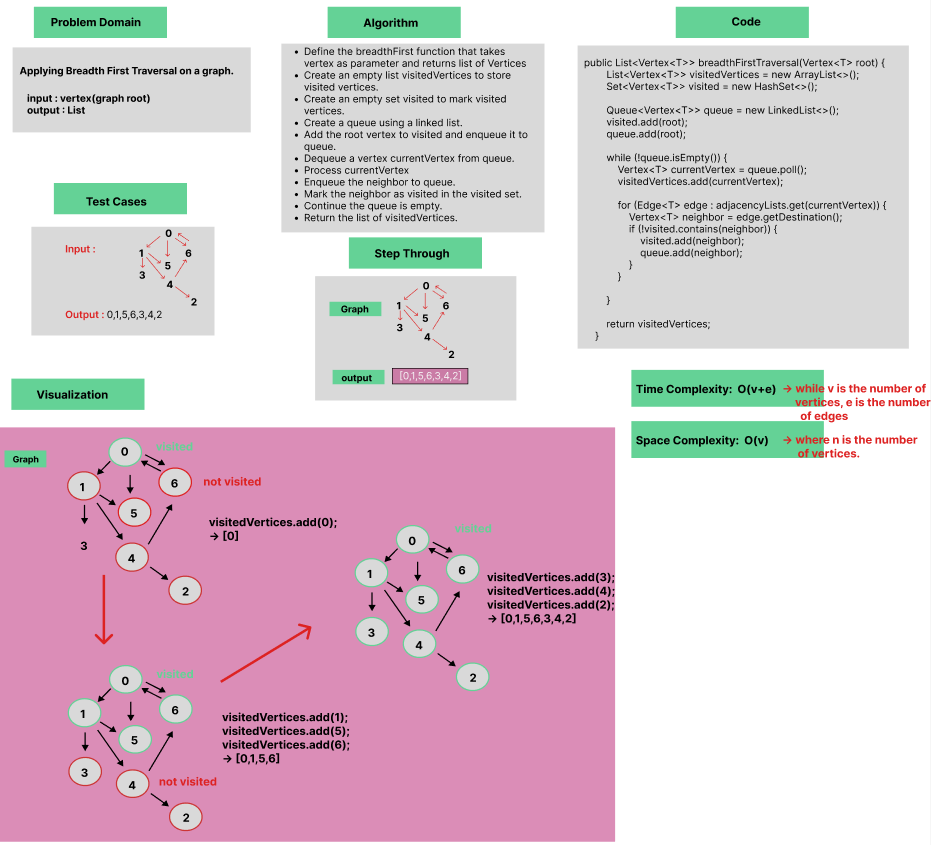
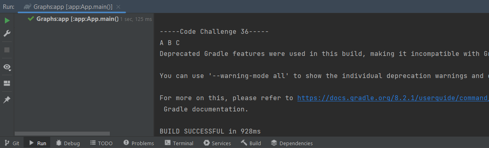

# Graph : Breadth-First Traversal

Applying Breadth First Traversal on a graph.

### Whiteboard Process

### Approach & Efficiency
Using OOP, For Loop, While Loop, If statement.

Approach :

- Create a queue to keep track of vertices to be visited.
- Create a set to mark vertices as visited.
- Enqueue the source vertex into the queue,add the root vertex to visited list.
- Dequeue a vertex from the queue.
- Enqueue the neighbor into the queue and add the neighbor as visited to visited list.

Efficiency :

 Average time Complexity : O(v+e) while v is the number of vertices and e is the number of edges, Space complexity : O(v) where n is the number of vertices.

### Solution

- [Link to code ](/Graphs/app/src/main/java/graphs/App.java)
```javapackage graphs;
  public List<Vertex<T>> breadthFirstTraversal(Vertex<T> root) {
        List<Vertex<T>> visitedVertices = new ArrayList<>();
        Set<Vertex<T>> visited = new HashSet<>();

        Queue<Vertex<T>> queue = new LinkedList<>();
        visited.add(root);
        queue.add(root);

        while (!queue.isEmpty()) {
            Vertex<T> currentVertex = queue.poll();
            visitedVertices.add(currentVertex);

            for (Edge<T> edge : adjacencyLists.get(currentVertex)) {
                Vertex<T> neighbor = edge.getDestination();
                if (!visited.contains(neighbor)) {
                    visited.add(neighbor);
                    queue.add(neighbor);
                }
            }

        }

        return visitedVertices;
    }
```

- Output :

