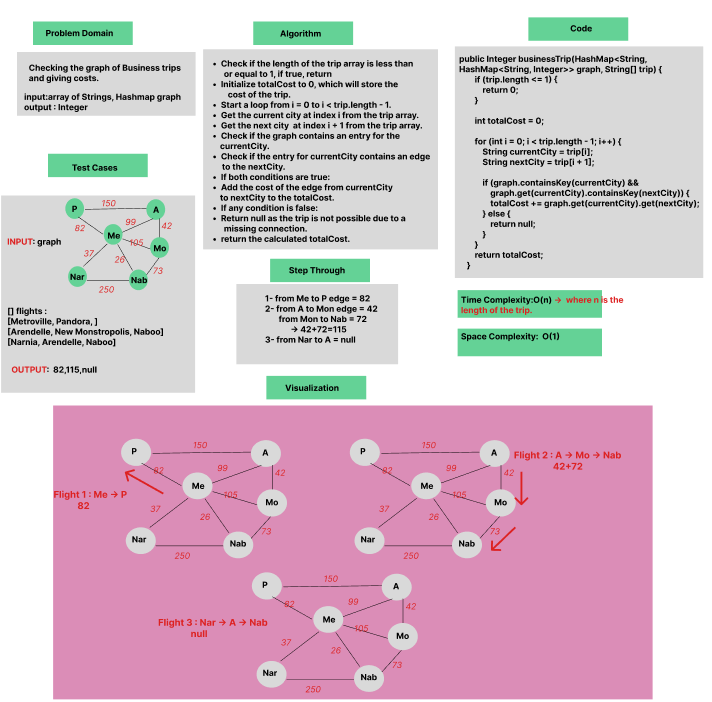
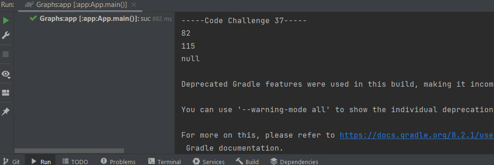

# Graph : Business Trip

Checking the graph of Business trips and giving costs.

### Whiteboard Process


### Approach & Efficiency
Using OOP, For Loop, If statement.

Approach :

- Iterating through the array of city names.
- Checking for direct flights and accumulating the total cost.
- Iterating through each city in the trip.

Efficiency :

- Average time Complexity : O(n) where n is the length of the trip, Space complexity : O(1) .


### Solution

- [Link to code ](/Graphs/app/src/main/java/graphs/App.java)
```javapackage graphs;
  public Integer businessTrip(HashMap<String, HashMap<String, Integer>> graph, String[] trip) {
        if (trip.length <= 1) {
            return 0;
        }

        int totalCost = 0;

        for (int i = 0; i < trip.length - 1; i++) {
            String currentCity = trip[i];
            String nextCity = trip[i + 1];

            if (graph.containsKey(currentCity) && graph.get(currentCity).containsKey(nextCity)) {
                totalCost += graph.get(currentCity).get(nextCity);
            } else {
                return null;
            }
        }
        return totalCost;
    }
```

- Output :

  