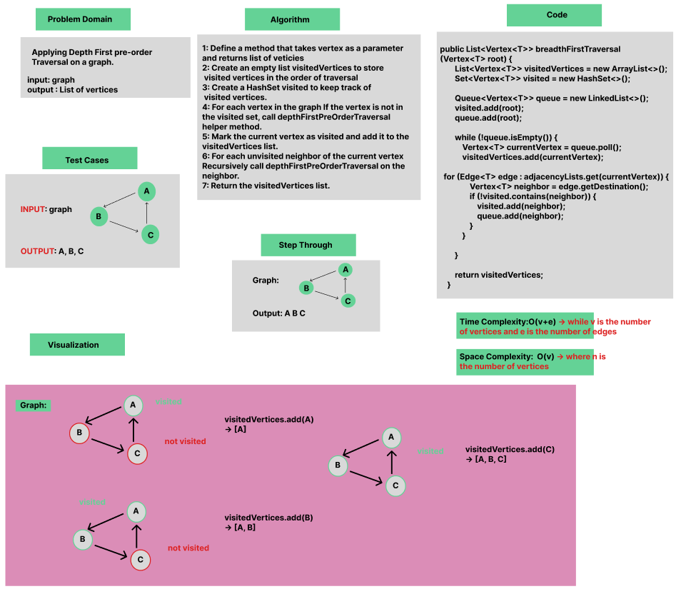
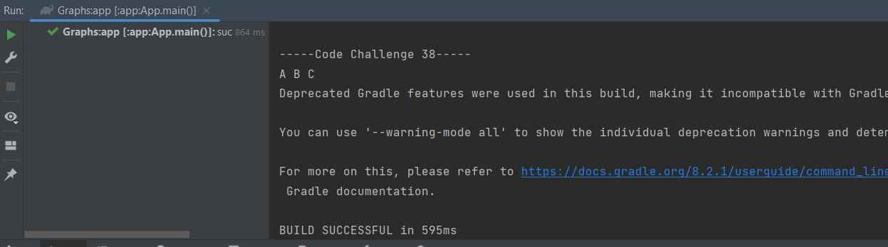

# Graph : Depth First pre-order Traversal

Applying Depth First pre-order Traversal on a graph.

### Whiteboard Process

### Approach & Efficiency
Using OOP, For Loop, If statement.

Approach :

- Create an empty list to store the vertices in the order they are visited.
- Create a HashSet to keep track of visited vertices.
- Iterate through all vertices in the graph.
- For each unvisited vertex, call the depthFirstPreOrderTraversal helper method to start the depth-first traversal.
- Return the list of visited vertices.

Efficiency :

Average time Complexity : O(v+e) while v is the number of vertices and e is the number of edges, Space complexity : O(v) where n is the number of vertices.

### Solution

- [Link to code ](/Graphs/app/src/main/java/graphs/App.java)
```javapackage graphs;
    public List<Vertex<T>> depthFirstPreOrderTraversal() {
        List<Vertex<T>> visitedVertices = new ArrayList<>();
        Set<Vertex<T>> visited = new HashSet<>();

        for (Vertex<T> vertex : adjacencyLists.keySet()) {
            if (!visited.contains(vertex)) {
                depthFirstPreOrderTraversal(vertex, visited, visitedVertices);
            }
        }
        return visitedVertices;
    }

    private void depthFirstPreOrderTraversal(Vertex<T> current, Set<Vertex<T>> visited, List<Vertex<T>> result) {
        visited.add(current);
        result.add(current);

        for (Edge<T> edge : adjacencyLists.get(current)) {
            Vertex<T> neighbor = edge.getDestination();
            if (!visited.contains(neighbor)) {
                depthFirstPreOrderTraversal(neighbor, visited, result);
            }
        }
    }
```

- Output :
