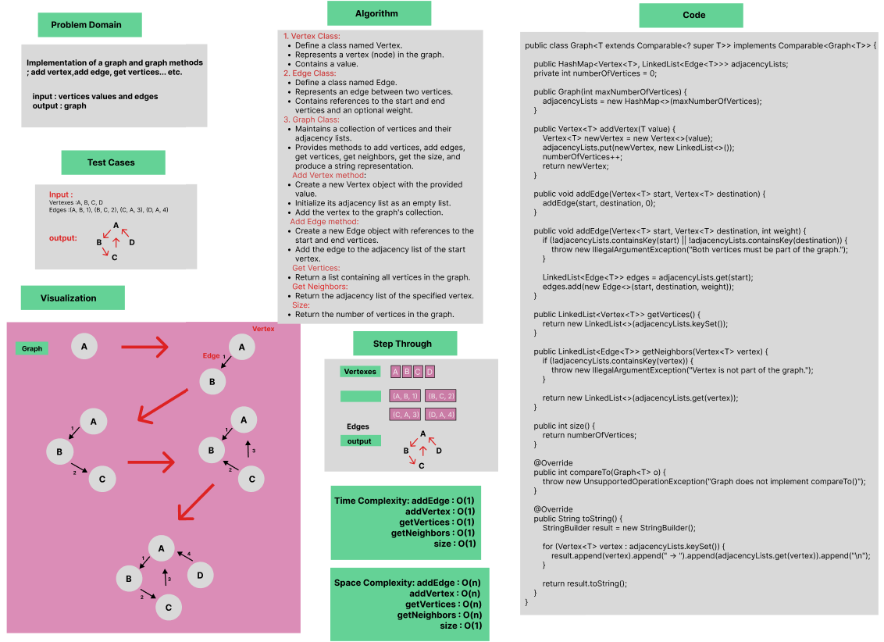
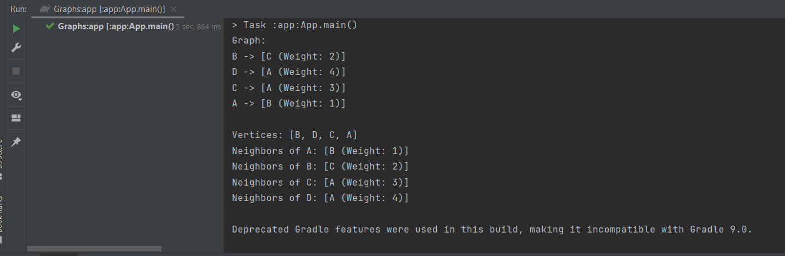

# Graph Implementation

Implementation of a graph and graph methods ; add vertex,add edge, get vertices... etc.

### Whiteboard Process


### Approach & Efficiency
Using OOP, For Loop, If statement.

Approach :

- Edge Class implementation.
- Vertex Class implementation.
- Graph Class implementation using Hashmap and Linked List.
- Hashmap type vertex, Linkedlist type Edge.
- Implementing different methods add edge, add vertex, get vertices, get neighbors and graph size.


Efficiency :

- Add edge : Average time Complexity : O(1), Space complexity : O(n) . 
- Add vertex : Average time Complexity : O(1), Space complexity : O(n) .
- Get neighbors : Average time Complexity : O(1), Space complexity : O(n) .
- Get vertices : Average time Complexity : O(1), Space complexity : O(n) .
- Graph size : Average time Complexity : O(1), Space complexity : O(1) .


### Solution

- [Link to code ](/Hashtable/app/src/main/java/graphs/App.java)
```javapackage graphs;
import java.util.HashMap;
import java.util.LinkedList;

public class Graph<T extends Comparable<? super T>> implements Comparable<Graph<T>> {

    public HashMap<Vertex<T>, LinkedList<Edge<T>>> adjacencyLists;
    private int numberOfVertices = 0;

    public Graph(int maxNumberOfVertices) {
        adjacencyLists = new HashMap<>(maxNumberOfVertices);
    }

    public Vertex<T> addVertex(T value) {
        Vertex<T> newVertex = new Vertex<>(value);
        adjacencyLists.put(newVertex, new LinkedList<>());
        numberOfVertices++;
        return newVertex;
    }

    public void addEdge(Vertex<T> start, Vertex<T> destination) {
        addEdge(start, destination, 0);
    }

    public void addEdge(Vertex<T> start, Vertex<T> destination, int weight) {
        if (!adjacencyLists.containsKey(start) || !adjacencyLists.containsKey(destination)) {
            throw new IllegalArgumentException("Both vertices must be part of the graph.");
        }

        LinkedList<Edge<T>> edges = adjacencyLists.get(start);
        edges.add(new Edge<>(start, destination, weight));
    }

    public LinkedList<Vertex<T>> getVertices() {
        return new LinkedList<>(adjacencyLists.keySet());
    }

    public LinkedList<Edge<T>> getNeighbors(Vertex<T> vertex) {
        if (!adjacencyLists.containsKey(vertex)) {
            throw new IllegalArgumentException("Vertex is not part of the graph.");
        }

        return new LinkedList<>(adjacencyLists.get(vertex));
    }

    public int size() {
        return numberOfVertices;
    }

    @Override
    public int compareTo(Graph<T> o) {
        throw new UnsupportedOperationException("Graph does not implement compareTo()");
    }

    @Override
    public String toString() {
        StringBuilder result = new StringBuilder();

        for (Vertex<T> vertex : adjacencyLists.keySet()) {
            result.append(vertex).append(" -> ").append(adjacencyLists.get(vertex)).append("\n");
        }

        return result.toString();
    }
}
```

- Output :

