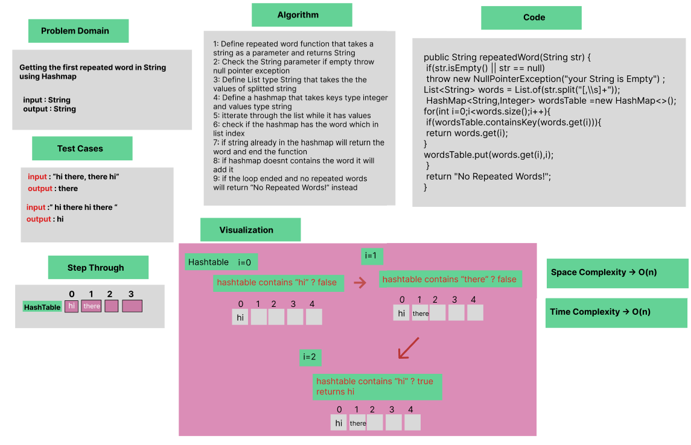
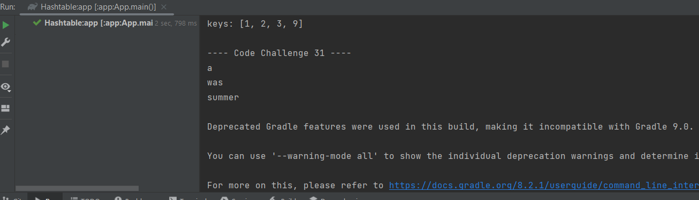

# Hashmap Repeated Word

Implementation of a method that finds the first word repeated in String.

### Whiteboard Process


### Approach & Efficiency
Using OOP, For Loop, If statement.

Approach :

- Splits the String and adds it to a List
- Adds the list elements to a Hashmap
- Checks if the element already in Hashmap, it returns it
- If Element not in the Hashmap, its added

Efficiency :

- Average time Complexity : O(n) space complexity : O(n).


### Solution

- [Link to code ](/Hashtable/app/src/main/java/hashtable/App.java)
```javapackage hashtable;
 public String repeatedWord(String str) {
        if(str.isEmpty() || str == null) 
        throw new NullPointerException("your String is Empty") ;

        List<String> words = List.of(str.split("[,\\s]+"));

        HashMap<String,Integer> wordsTable =new HashMap<>();
        for(int i=0;i<words.size();i++){
            if(wordsTable.containsKey(words.get(i))){
                return words.get(i);
            }
            wordsTable.put(words.get(i),i);
        }

        return "No Repeated Words!";
    }

```

- Output :


