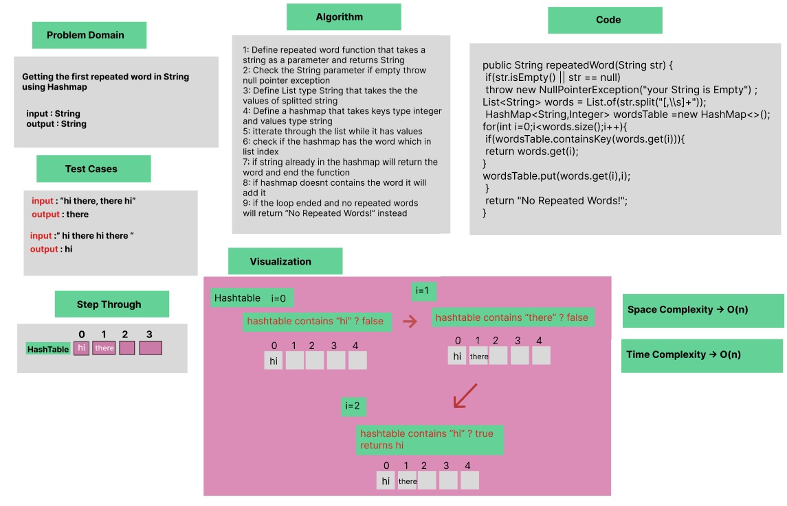

# Hash Table Implementation

### Whiteboard Process



### Approach & Efficiency
OOP, While Loop, If statement


### Solution

- [Link to code ](/Hashtable/app/src/main/java/hashtable/App.java)
```java
public class HashTable<T> {

    int size;
    Node hashArray[];

    public HashTable(int size){
        this.size=size;
        hashArray=new Node[size];
        for(int i=0;i<hashArray.length;i++){
            hashArray[i]= new Node<T>();
        }
    }

    public int hash(int key){
        return key%size;
    }

    public void set(int key,T value){
        int index = hash(key);
        Node<T> originalValue = hashArray[index];
        Node<T> newValue = new Node<>(key,value);
        newValue.next=originalValue.next;
        originalValue.next=newValue;
    }


    public T get(int key){
        int index = hash(key);
        Node<T> current = hashArray[index];
        while(current != null){
            if(current.getKey() == key)
                return current.getValue();

            current=current.next;
        }
        return null;
    }

    public boolean has(int key) {
        for (int i = 0; i < hashArray.length; i++) {
            Node<T> current = hashArray[i];
            while (current != null) {
                if(current.getKey() == key){
                    return true;
                }
                current = current.next;
            }
        }
        return false;
    }
    
}
```
