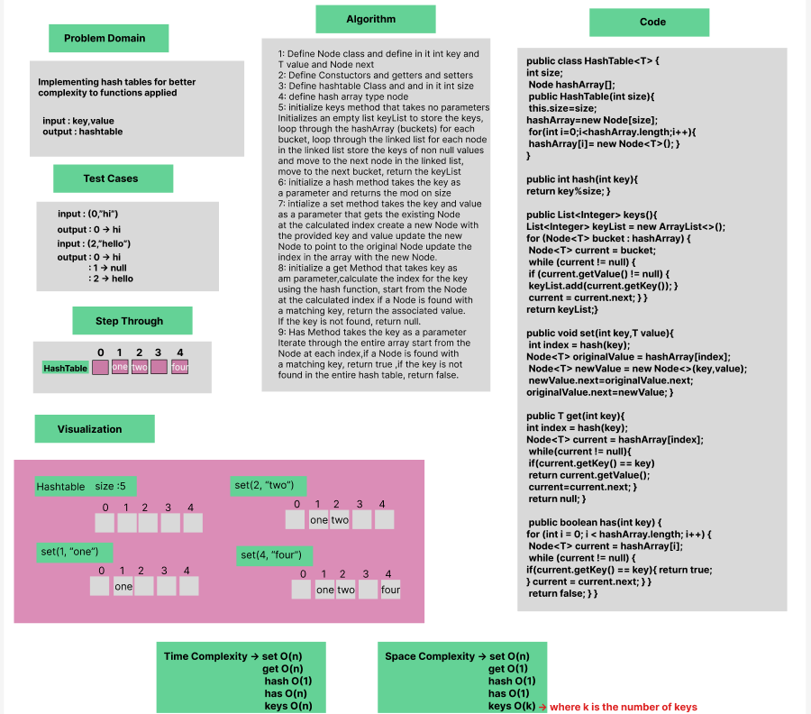

# Hash Table Implementation

Implementation of simple Hash table class with  basic functionality like set,get,hash,has and keys methods.

### Whiteboard Process


### Approach & Efficiency
Using OOP, While Loop, If statement.

Approach :

- Set method: hashes the key and adds the value in the hashed key index.
- Get method: hashes the key and iterates through the array and returns the value of hashed key index.
- Has method: checks the value of given key if not null returns true, else returns false.
- Hash method: hashes the given key by finding its mod on the array size and returns the hashed key.
- Keys method: iterates through the array and returns list of keys which values aren't null.

Efficiency :
- Set method: Average time Complexity : O(1), worst case is O(n), space complexity : O(n). 
- Get method: Average time Complexity : O(1), worst case is O(n), space complexity : O(1).
- Has method: Average time Complexity : O(1), worst case is O(n), space complexity : O(1).
- Hash method: Average time Complexity : O(1), space complexity : O(1).
- Keys method: Average time Complexity : O(n), space complexity : O(k).


### Solution

- [Link to code ](/Hashtable/app/src/main/java/hashtable/App.java)
```javapackage hashtable;
public class HashTable<T> {

    int size;
    Node<T> hashArray[];

    public HashTable(int size){
        this.size=size;
        hashArray=new Node[size];
        for(int i=0;i<hashArray.length;i++){
            hashArray[i]= new Node<T>();
        }
    }

    public List<Integer> keys(){
        List<Integer> keyList = new ArrayList<>();

        for (Node<T> bucket : hashArray) {
            Node<T> current = bucket;
            while (current != null) {
                if (current.getValue() != null)
                {
                    keyList.add(current.getKey());
                }
                current = current.next;
            }
        }

        return keyList;
    }


    public int hash(int key){
        return key%size;
    }

    public void set(int key,T value){
        int index = hash(key);
        Node<T> originalValue = hashArray[index];
        Node<T> newValue = new Node<>(key,value);
        newValue.next=originalValue.next;
        originalValue.next=newValue;
    }


    public T get(int key){
        int index = hash(key);
        Node<T> current = hashArray[index];
        while(current != null){
            if(current.getKey() == key)
                return current.getValue();

            current=current.next;
        }
        return null;
    }

    public boolean has(int key) {
        for (int i = 0; i < hashArray.length; i++) {
            Node<T> current = hashArray[i];
            while (current != null) {
                if(current.getKey() == key){
                    return true;
                }
                current = current.next;
            }
        }
        return false;
    }


}


```
