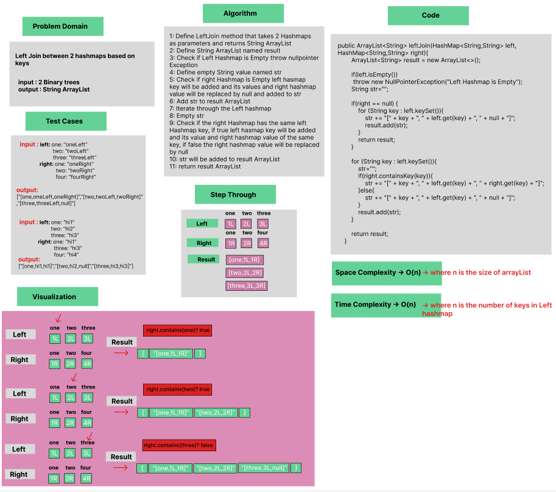
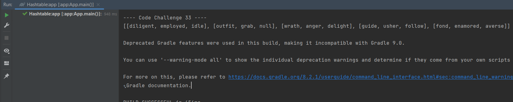

# Hashmap Left Join

Implementation of a method that Left joins between 2  String HashMaps.

### Whiteboard Process




### Approach & Efficiency
Using OOP, For Loop, If statement.

Approach :

- Checks if right Hashmap has the same key as left Hashmap.
- If right Hashmap has the same key; the key,left hashmap key value,right hashmap key value will be added.
- If right Hashmap doesn't have the same key; the key,left hashmap key value will be added and right value will be replaced by null.
- Strings added to an ArrayList.

Efficiency :

- Average time Complexity : O(n) where n is the number of keys in Left hashmap, space complexity : O(n) where n is the size of arrayList.


### Solution

- [Link to code ](/Hashtable/app/src/main/java/hashtable/App.java)

```javapackage hashtable;
 public ArrayList<String> leftJoin(HashMap<String,String> left,HashMap<String,String> right){
        ArrayList<String> result = new ArrayList<>();

        if(left.isEmpty()) throw new NullPointerException("Left Hashmap is Empty");
        String str="";

        if(right == null) {
            for (String key : left.keySet()){
                str += "[" + key + ", " + left.get(key) + ", " + null + "]";
                result.add(str);
            }
            return result;
        }

        for (String key : left.keySet()){
            str="";
            if(right.containsKey(key)){
                str += "[" + key + ", " + left.get(key) + ", " + right.get(key) + "]";
            }else{
                str += "[" + key + ", " + left.get(key) + ", " + null + "]";
            }
            result.add(str);
        }

        return result;
    }
```

- Output :


