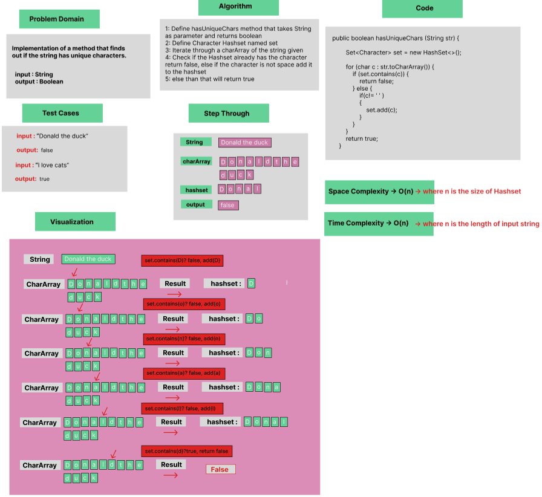
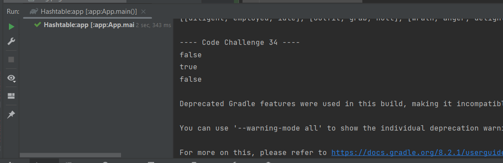

# Mock Interview : Determine if a string is full of unique characters.

Implementation of a method that finds out if the string has unique characters.

### Whiteboard Process


### Approach & Efficiency
Using OOP, For Loop, If statement.

Approach :

- Splits the String and adds it to character array.
- Checks if the character is already in the hashset returns false.
- If the character is not in the hashset, and it's not space will be added to the hashset.
- Else method return true.

Efficiency :

- Average time Complexity : O(n) where n is the length of input string, Space complexity : O(n) where n is the size of Hashset


### Solution

- [Link to code ](/Hashtable/app/src/main/java/hashtable/App.java)
```javapackage hashtable;
  public boolean hasUniqueChars (String str) {

        Set<Character> set = new HashSet<>();

        for (char c : str.toCharArray()) {
            if (set.contains(c)) {
                return false;
            } else {
                if(c!= ' ' )
                {
                    set.add(c);
                }
            }
        }
        return true;
    }
```

- Output :


