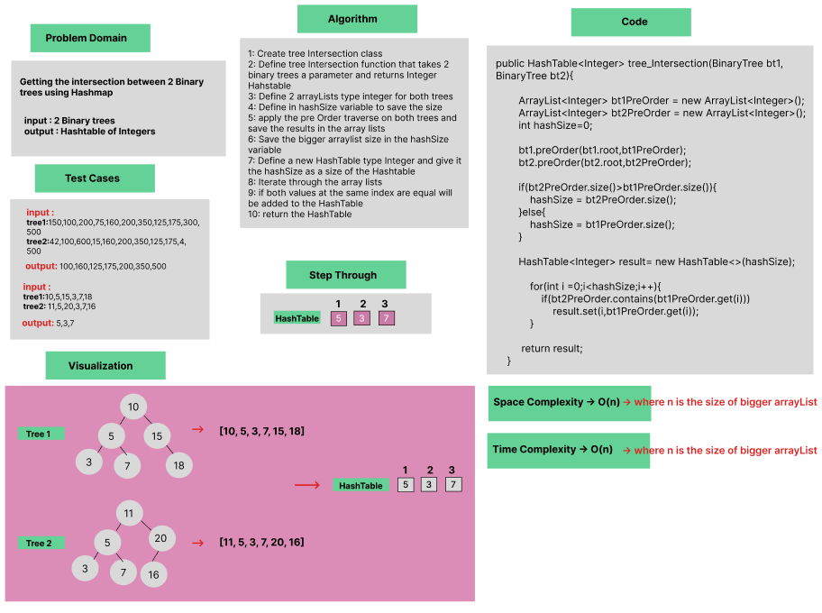
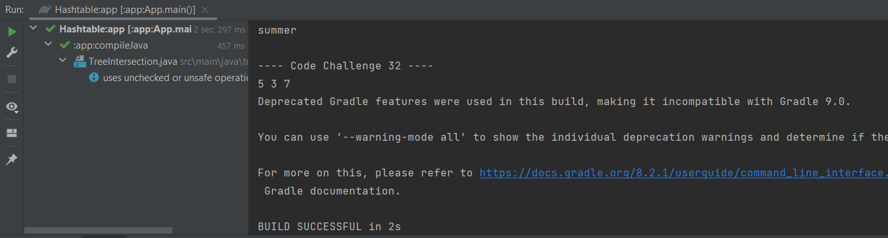

# Tree Intersection

Implementation of a method that finds the intersection between 2 Binary trees using Hashmap.

### Whiteboard Process



### Approach & Efficiency
Using OOP, For Loop, If statement.

Approach :

- Pre Orders the 2 trees sent
- Creates a hashtable with same size of the trees
- Checks if the element is in both trees 
- If Element is in both trees, its added to the hashtable

Efficiency :

- Average time Complexity : O(n)  where n is the size of bigger arrayList, space complexity : O(n)  where n is the size of bigger arrayList.


### Solution

- [Link to code ](/Hashtable/app/src/main/java/hashtable/App.java)

```javapackage hashtable;
  public HashTable<Integer> tree_Intersection(BinaryTree bt1, BinaryTree bt2){

        ArrayList<Integer> bt1PreOrder = new ArrayList<Integer>();
        ArrayList<Integer> bt2PreOrder = new ArrayList<Integer>();
        int hashSize=0;
       
        bt1.preOrder(bt1.root,bt1PreOrder);
        bt2.preOrder(bt2.root,bt2PreOrder);
 
        
        if(bt2PreOrder.size()>bt1PreOrder.size()){
            hashSize = bt2PreOrder.size();
        }else{
            hashSize = bt1PreOrder.size();
        }

        HashTable<Integer> result= new HashTable<>(hashSize);

            for(int i =0;i<hashSize;i++){
                if(bt2PreOrder.contains(bt1PreOrder.get(i)))
                    result.set(i,bt1PreOrder.get(i));
            }

         return result;
    }
```

- Output :


