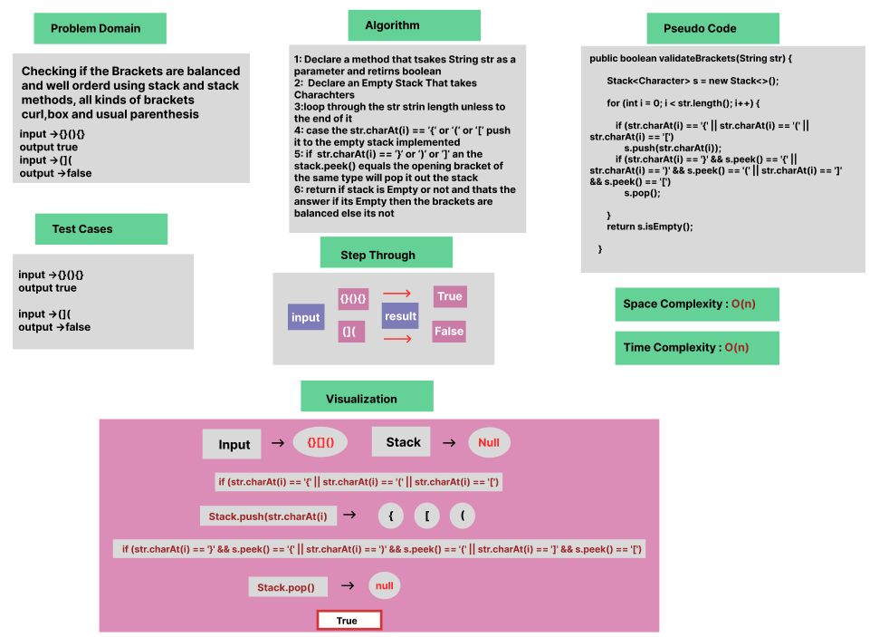

# Multi-bracket Validation

### Whiteboard Process


### Approach & Efficiency

OOP, For Loop, If statement


### Solution

- [Link to code ](/LinkedList/app/src/main/java/stack/App.java)

```java 
package stack;

public class Stack<T> {
    public boolean validateBrackets(String str) {

        Stack<Character> s = new Stack<>();

        for (int i = 0; i < str.length(); i++) {

            if (str.charAt(i) == '{' || str.charAt(i) == '(' || str.charAt(i) == '[')
                s.push(str.charAt(i));
            if (str.charAt(i) == '}' && s.peek() == '{' || str.charAt(i) == ')' && s.peek() == '(' || str.charAt(i) == ']' && s.peek() == '[')
                s.pop();

        }
        return s.isEmpty();

    }
}
```
```java 
package stack;

    public class App { 
       public static void main(String[] args) {
        Stack stack = new Stack<>();
        System.out.println(stack.validateBrackets("()[[Extra Characters]]")); //true
        System.out.println(stack.validateBrackets("(){}[[]]")); //true
        System.out.println(stack.validateBrackets("[({}]")); //false
        System.out.println(stack.validateBrackets("(]("));//false
    }
}
```


