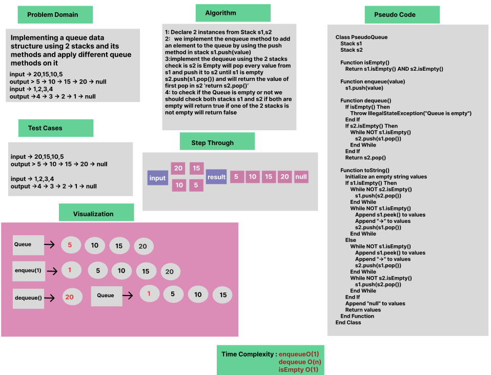

 # Pseudo Queue implementation

Whiteboard Process

Approach & Efficiency

OOP, If Statment, while Loop

Solution

- [Pseudo Queue](/LinkedList/app/src/main/java/stack/App.java)


````
package stack;

public class PseudoQueue {
    Node top;
    Stack s1 =new Stack();
    Stack s2 =new Stack();

 public boolean isEmpty(){
     return s1.isEmpty() && s2.isEmpty();
 }

 public void enqueue(int value){
     s1.push(value);
 }

 public int dequeue(){
     if (isEmpty()==true) {
         throw new IllegalStateException("Queue is empty");
     }

     if (s2.isEmpty()) {
         while (!s1.isEmpty()) {
             s2.push(s1.pop());
         }
     }

     return s2.pop();
 }

    @Override
    public String toString() {
        String values = "";
        if (s1.isEmpty()) {
            while (!s2.isEmpty()) {
                s1.push(s2.pop());
            }
            while (!s1.isEmpty()) {
                values+= (s1.peek()) + ("->");
                s2.push(s1.pop());
            }
        } else {
            while (!s1.isEmpty()) {
                values += (s1.peek()) +("->");
                s2.push(s1.pop());
            }
            while (!s2.isEmpty()) {
                s1.push(s2.pop());
            }
        }
        values += null;
        return values;
    }
}

````