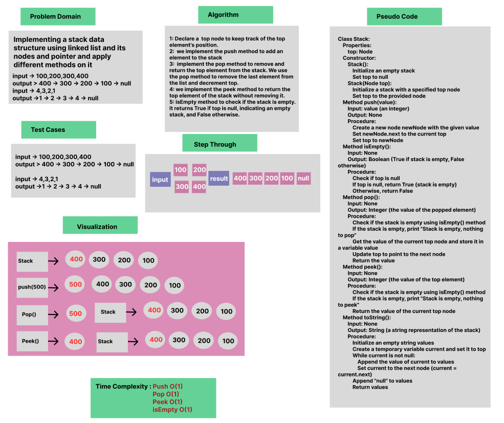
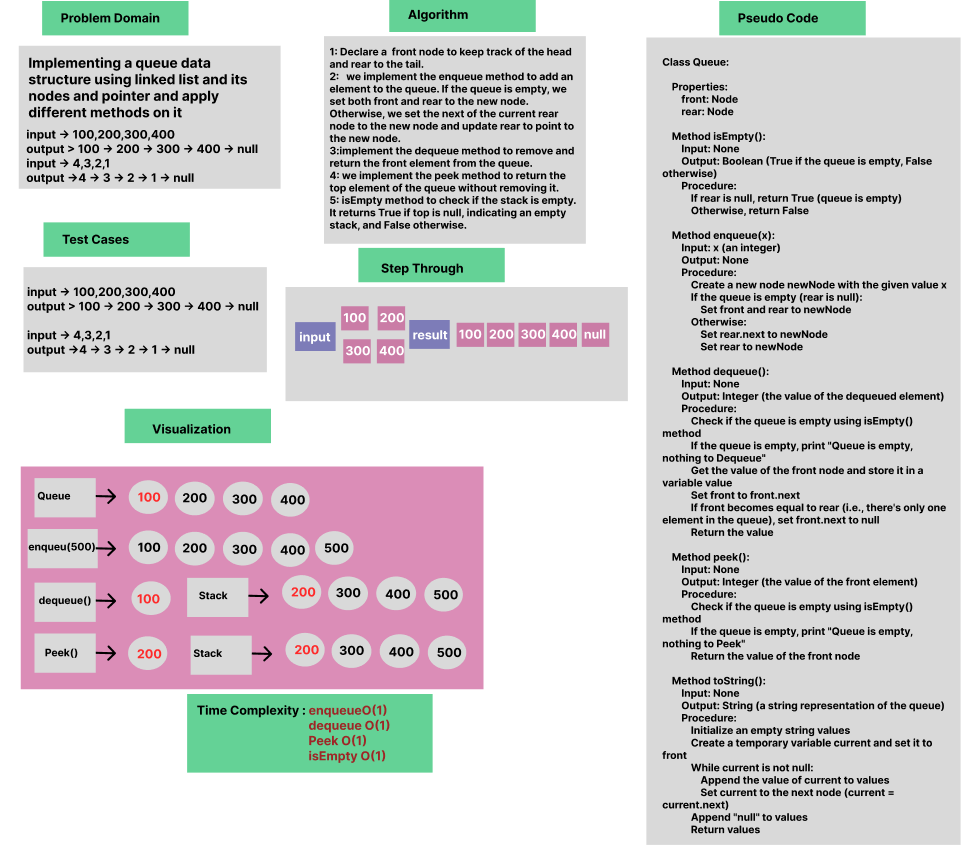

# Stack and Queue implementation

Whiteboard Process

# Stack


# Queue



Approach & Efficiency

OOP, If Statment

Solution

- [Stack](/LinkedList/app/src/main/java/stack/App.java)

- [Queue ](/LinkedList/app/src/main/java/queue/App.java)
  
````
package stack;

public class Stack {

    Node top;

    public Stack() {
    }

    public Stack(Node top) {
        this.top = top;
    }

    public void push(int value){
        Node newNode = new Node(value);
        newNode.next=top;
        top=newNode;
    }

    public boolean isEmpty(){
        return top ==null;
    }
    public int pop() {

            if (isEmpty())
                System.out.println("Stack is empty, nothing to pop");


            int value = top.value;
            top = top.next;
            return value;
        }


public int peek(){

    if (isEmpty())
        System.out.println("Stack is empty, nothing to peek");


       return top.value;

}
@Override
public String toString() {
String values = "";
Node current = top; // Create a temporary variable to iterate through the nodes
while (current != null) {
values += current.value + "->";
current = current.next;
}
values += "null";
return values;

    }
    }

`````
`````
package queue;

public class Queue {

    Node front;
    Node rear;
public boolean isEmpty(){
    if(rear==null) return true;

    return false;
}
    public void enqueue(int x){
        Node newNode=new Node(x);
        if(isEmpty()){
            rear=front=newNode;
        }
        rear.next=newNode;
        rear=newNode;

    }
    public int dequeue(){
       int value;
         if (isEmpty())
         System.out.println("Queue is empty, nothing to Dequeue");
         value= front.value;;
       front=front.next;

        if(front == rear) front.next=null;
         return value;
    }
    public int peek(){

        if (isEmpty())
            System.out.println("Queue is empty, nothing to Peek");

        return front.value;

    }
    @Override
    public String toString() {
        String values = "";
        Node current = front; // Create a temporary variable to iterate through the nodes
        while (current != null) {
            values += current.value + "->";
            current = current.next;
        }
        values += "null";
        return values;

    }
}

`````
