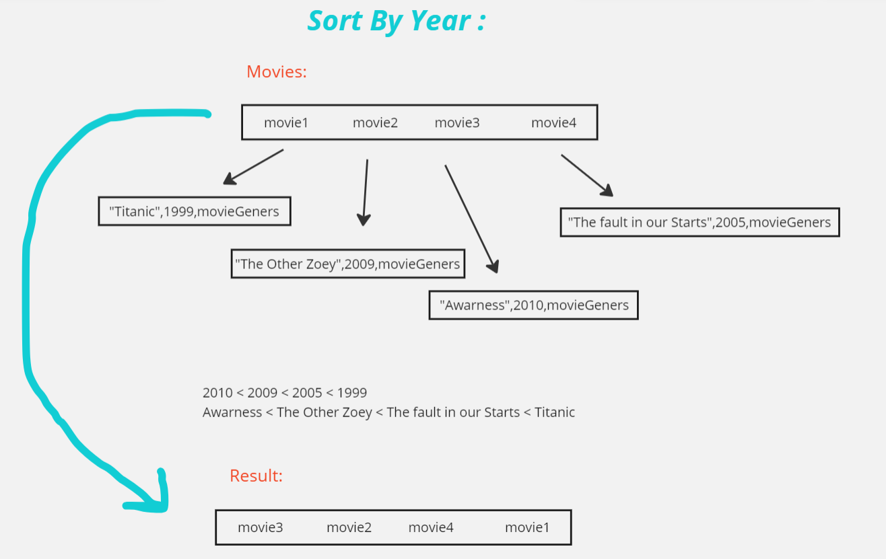
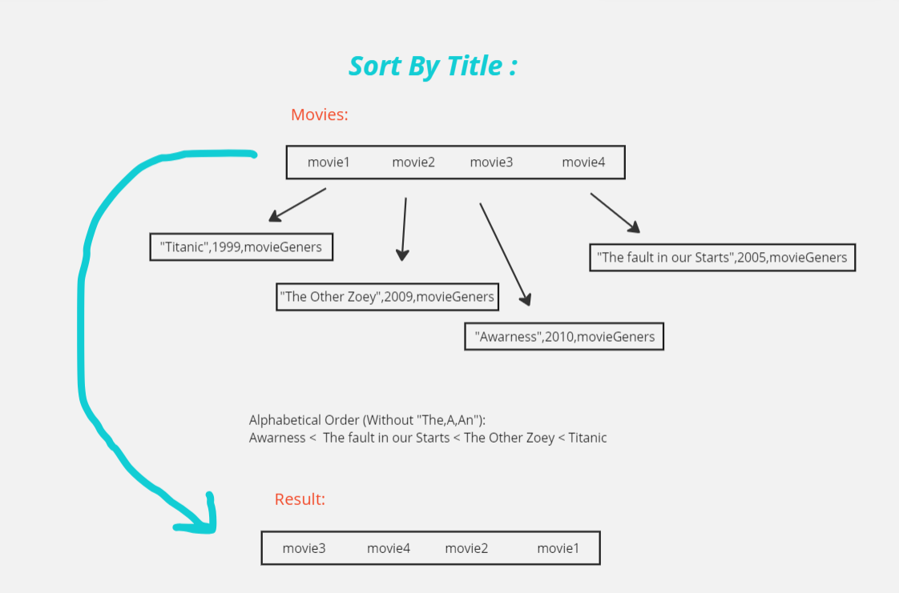

# Sorting : Comparison


A comparison sort is a type of sorting algorithm that only reads the list elements through a single abstract comparison operation (often a "less than or equal to" operator or a three-way comparison) that determines which of two elements should occur first in the final sorted list.

## Pseudo Code

````
function compareNumbers(a, b) {
  if (a == b) return 0;
  if (a < b) return -1;
  if (a > b) return 1;
}
````

## Code

````
  public static Movie[] sortByYear(Movie[] movies) {
        Arrays.sort(movies, (a, b) -> b.getYear() - a.getYear());
        return movies;
    }

    public static Movie[] sortByTitle(Movie[] movies) {
        Arrays.sort(movies, (a, b) -> {
            String titleA = a.getTitle().replaceFirst("^(?i)(A|An|The) ", "");
            String titleB = b.getTitle().replaceFirst("^(?i)(A|An|The) ", "");
            return titleA.compareToIgnoreCase(titleB);
        });
        return movies;
    }
````

## Trace 




## Big (O):

- Time Complexity : O(nLogN) , due to the sorting algorithm used by Arrays.sort.
- Space Complexity : O(logN) ,  Both methods use the merge sort algorithm for sorting.