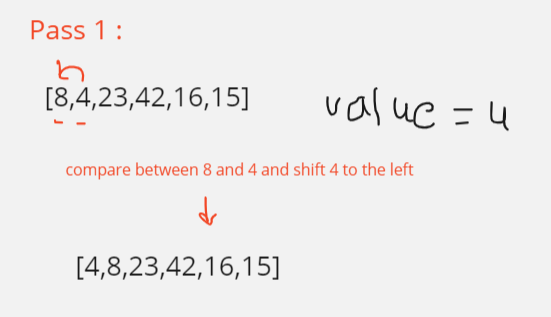
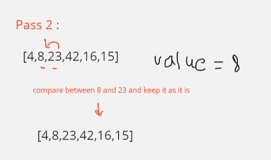
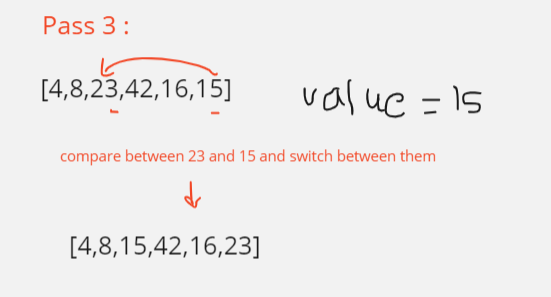
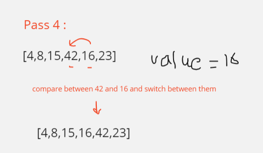
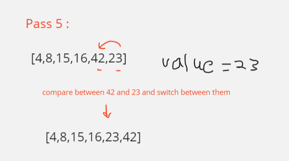

# Sorting 

Insertion sort is a simple sorting algorithm that works similar to the way you sort playing cards in your hands. The array is virtually split into a sorted and an unsorted part. Values from the unsorted part are picked and placed at the correct position in the sorted part.

---

## Pseudo code 
````
Insert(int[] sorted, int value)
initialize i to 0
WHILE value > sorted[i]
set i to i + 1
WHILE i < sorted.length
set temp to sorted[i]
set sorted[i] to value
set value to temp
set i to i + 1
append value to sorted

InsertionSort(int[] input)
LET sorted = New Empty Array
sorted[0] = input[0]
FOR i from 1 up to input.length
Insert(sorted, input[i])
return sorted

````

---

## Code 

```java
public class InsertingSorted {


    public void insertionSort(int[] arr) {

        for (int i = 1; i <  arr.length; i++) {
            int value = arr[i];
            int j = i - 1;
            while (j >= 0 && arr[j] > value) {
                arr[j + 1] = arr[j];
                j = j - 1;
            }
            arr[j + 1] = value;
        }
    }
    
}
```

---

## Trace
 
 

---

## Big (O)

- Time Complexity : O(n^2) , in the worst case, it may need to travers the entire sorted array
- Space Complexity : O(1), it uses constant amount of extra variables.
