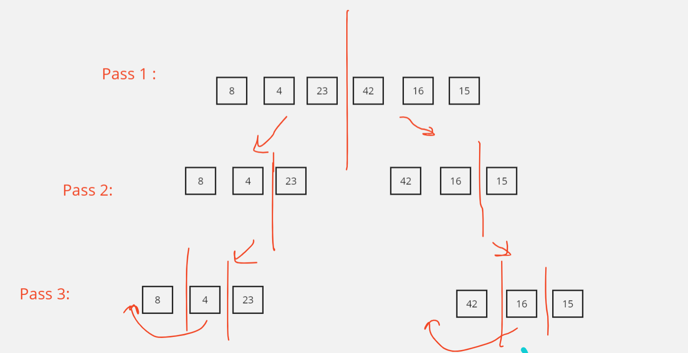
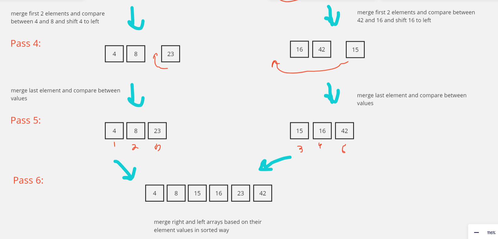

# Merge Sort

Merge sort is defined as a sorting algorithm that works by dividing an array into smaller subarrays, sorting each subarray, and then merging the sorted subarrays back together to form the final sorted array.

---

## Pseudo Code

````ALGORITHM Mergesort(arr)
    DECLARE n <-- arr.length

    if n > 1
      DECLARE mid <-- n/2
      DECLARE left <-- arr[0...mid]
      DECLARE right <-- arr[mid...n]
      // sort the left side
      Mergesort(left)
      // sort the right side
      Mergesort(right)
      // merge the sorted left and right sides together
      Merge(left, right, arr)

ALGORITHM Merge(left, right, arr)
    DECLARE i <-- 0
    DECLARE j <-- 0
    DECLARE k <-- 0

    while i < left.length && j < right.length
        if left[i] <= right[j]
            arr[k] <-- left[i]
            i <-- i + 1
        else
            arr[k] <-- right[j]
            j <-- j + 1

        k <-- k + 1

    if i = left.length
       set remaining entries in arr to remaining values in right
    else
       set remaining entries in arr to remaining values in left
````

---

## Code 

```java
public class MergeSort {

    public int[] sort(int[] input){

        if(input.length <=1) return input;

        int mid = input.length/2;
        int[] left = Arrays.copyOf(input,mid);
        int[] right = Arrays.copyOfRange(input,mid,input.length);

        left = sort(left);
        right = sort(right);

        int tempLeft = 0;
        int tempRight = 0;
        int i=0;
        int result[]=new int[input.length];

        while (tempLeft < left.length || tempRight < right.length){
            if(tempLeft >= left.length){
                while(tempRight < right.length){
                    result[i] = right[tempRight];
                    i++;tempRight++;
                }
                break;
            }
            if(tempRight >= right.length){
                while(tempLeft < left.length){
                    result[i] = left[tempLeft];
                    i++;tempLeft++;
                }
                break;
            }

            if(left[tempLeft] <= right[tempRight]){
                result[i] = left[tempLeft];
                i++;tempLeft++;
            }else{
                result[i] = right[tempRight];
                i++;tempRight++;
            }
        }
        return result;
        
    }
}
```
---

## Trace


---

## Big (o)

- Time Complexity : O(n Log n),  where n is the number of elements in the input array and because the array is recursively divided into halves.
- Space Complexity : O(n), the algorithm uses additional arrays.
