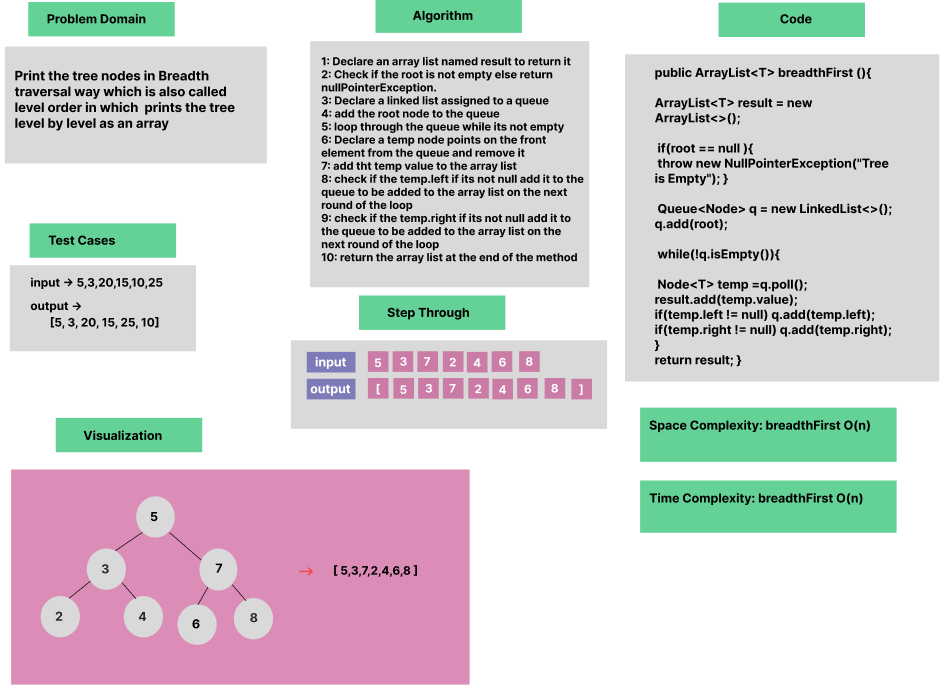

# Trees : Breadth-first Traversal


### Whiteboard Process


### Approach & Efficiency
OOP , While Loop & if Statement

### Solution

- [Link to code ](/Trees/app/src/main/java/trees/App.java)

```java
package trees;

public class BinaryTree<T>   {
    public ArrayList<T> breadthFirst (){

        ArrayList<T> result = new ArrayList<>();

        if(root == null ){
            throw new NullPointerException("Tree is Empty");
        }

        Queue<Node> q = new LinkedList<>();

        q.add(root);
        while(!q.isEmpty()){
            Node<T> temp =q.poll();
            result.add(temp.value);
            if(temp.left != null) q.add(temp.left);
            if(temp.right != null) q.add(temp.right);

        }
        return result;

    }
}
```