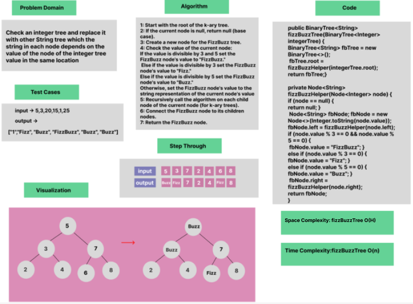

# Trees : FizzBuzz

### Whiteboard Process

### Approach & Efficiency
OOP, if Statement

### Solution

- [Link to code ](Trees/app/src/main/java/trees/BinaryTree.java)

```java
package trees;

public class BinaryTree<T>   {
    public BinaryTree<String> fizzBuzzTree(BinaryTree<Integer> integerTree) {
        BinaryTree<String> fbTree = new BinaryTree<>();
        fbTree.root = fizzBuzzHelper(integerTree.root);
        return fbTree;
    }

    private Node<String> fizzBuzzHelper(Node<Integer> node) {
        if (node == null) {
            return null;
        }

        Node<String> fbNode;
        if (node.value % 3 == 0 && node.value % 5 == 0) {
            fbNode = new Node<>("FizzBuzz");
        } else if (node.value % 3 == 0) {
            fbNode = new Node<>("Fizz");
        } else if (node.value % 5 == 0) {
            fbNode = new Node<>("Buzz");
        } else {
            fbNode = new Node<>(Integer.toString(node.value));
        }

        fbNode.left = fizzBuzzHelper(node.left);
        fbNode.right = fizzBuzzHelper(node.right);

        return fbNode;
    }
}
```

```java
public class BinaryTree<T> {
    public void traverseTree(Node<String> node, List<String> result) {
        if (node != null) {
            traverseTree(node.left, result);
            result.add(node.value);
            traverseTree(node.right, result);
        }
    }
}
```