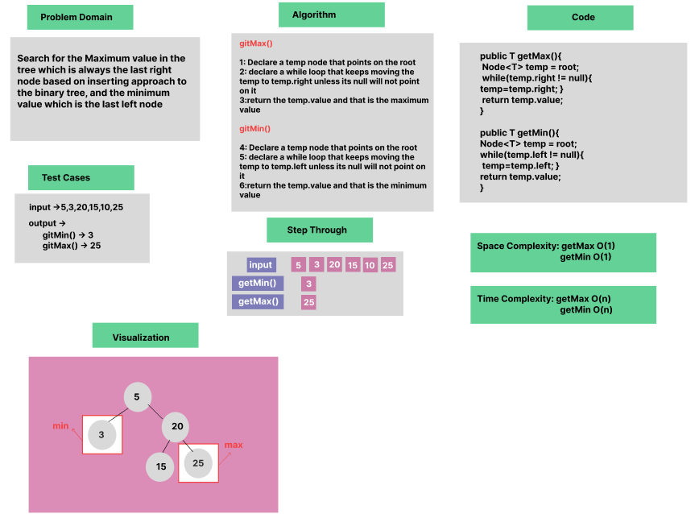

# Trees : Get Min & Max values


### Whiteboard Process


### Approach & Efficiency
OOP , While Loop

### Solution

- [Link to code ](/Trees/app/src/main/java/trees/App.java)

```java
package trees;

public class BinaryTree<T> {
    
    
    public T getMax() {

       if (root == null) {
            throw new NullPointerException("Tree is empty, cannot find maximum.");
        }
        Node<T> temp = root;
        while (temp.right != null) {
            temp = temp.right;
        }
        return temp.value;
    }

    public T getMin() {

     if (root == null) {
            throw new NullPointerException("Tree is empty, cannot find minimum.");
        }

        Node<T> temp = root;
        while (temp.left != null) {
            temp = temp.left;
        }
        return temp.value;
    }
}
```
