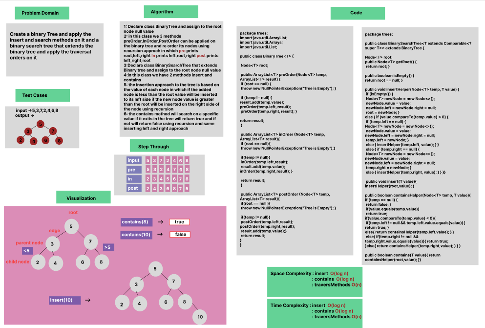

# Trees


### Whiteboard Process



### Approach & Efficiency
If statement , Recursion and OOP

### Solution

- [Link to code ](/Trees/app/src/main/java/trees/App.java)


```java 

package trees;

import java.util.ArrayList;
import java.util.Arrays;
import java.util.List;

public class BinaryTree<T> {

    Node<T> root;

    public ArrayList<T> preOrder(Node<T> temp, ArrayList<T> result) {
        if (root == null) {
            throw new NullPointerException("Tree is Empty");
        }
        if (temp != null) {
            result.add(temp.value);
            preOrder(temp.left, result);
            preOrder(temp.right, result);
        }
        return result;
    }


    public ArrayList<T> inOrder (Node<T> temp, ArrayList<T> result){

        if (root == null){
            throw new NullPointerException("Tree is Empty");
        }

        if(temp != null){
            inOrder(temp.left,result);
            result.add(temp.value);
            inOrder(temp.right,result);
        }
        return result;
    }

    public ArrayList<T> postOrder (Node<T> temp, ArrayList<T> result){

        if(root == null ){
            throw new NullPointerException("Tree is Empty");
        }

        if(temp != null){
            postOrder(temp.left,result);
            postOrder(temp.right,result);
            result.add(temp.value);
        }
        return result;
    }


}

```

```java
package trees;


public class BinarySearchTree<T extends Comparable<? super T>> extends BinaryTree {

    Node<T> root;

    public Node<T> getRoot() {
        return root;
    }

    public boolean isEmpty() {
        return root == null;
    }

public void insertHelper(Node<T> temp, T value) {
    if (isEmpty()) {
        Node<T> newNode = new Node<>();
        newNode.value = value;
        newNode.left = newNode.right = null;
        root = newNode;
    } else {
        if (value.compareTo(temp.value) < 0) {
            if (temp.left == null) {
                Node<T> newNode = new Node<>();
                newNode.value = value;
                newNode.left = newNode.right = null;
                temp.left = newNode;
            } else {
                insertHelper(temp.left, value);
            }
        } else {
            if (temp.right == null) {
                Node<T> newNode = new Node<>();
                newNode.value = value;
                newNode.left = newNode.right = null;
                temp.right = newNode;
            } else {
                insertHelper(temp.right, value);
            }
        }
    }
}

    public void insert(T value){

            insertHelper(root,value);

    }

    public boolean containsHelper(Node<T> temp, T value){

        if (temp == null) {
            return false;
        }

        if(value.equals(temp.value))
            return true;

        if(value.compareTo(temp.value) < 0){
            if(temp.left != null && temp.left.value.equals(value)){
                return true;
            }else{
               return containsHelper(temp.left,value);
            }
    }
        else{
            if(temp.right != null && temp.right.value.equals(value)){
                return true;
            }else{
                return  containsHelper(temp.right,value);
            }
        }


    }

    public boolean contains(T value){

        return containsHelper(root,value);
    }


}


```
